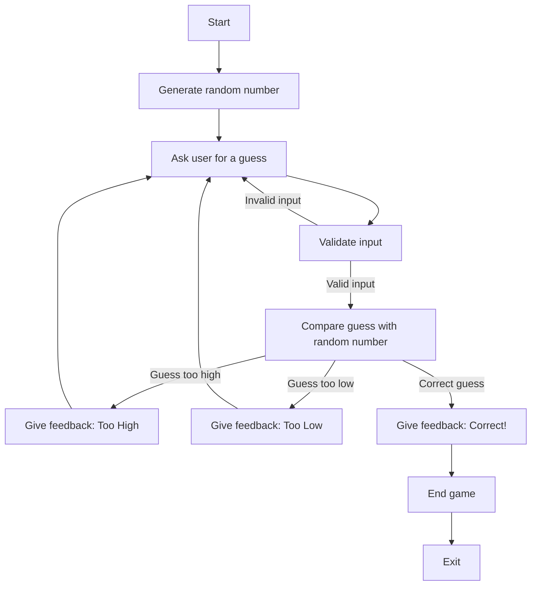

# Random Guessing Game Flowchart

### Explanation:
1.) **Game Start**: The game starts, the computer generates a random number

2.) **Random Number genrates**: The computer selects a number

3.) **Use choses a Number**: The user now enters a number of their own

4.) **Is it correct?**: The game then checks to see if the guess is too high,low, or correct

5.) **Feedback**: The game then provides the help to them. And then lets them guess again

6.) **Game Over**: The game ends when the player finally guesses the correct number
